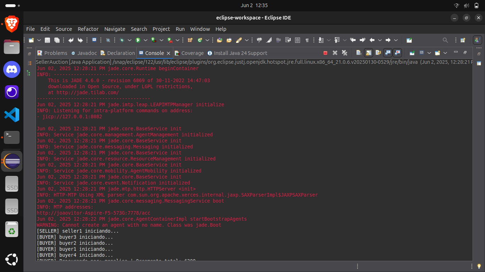
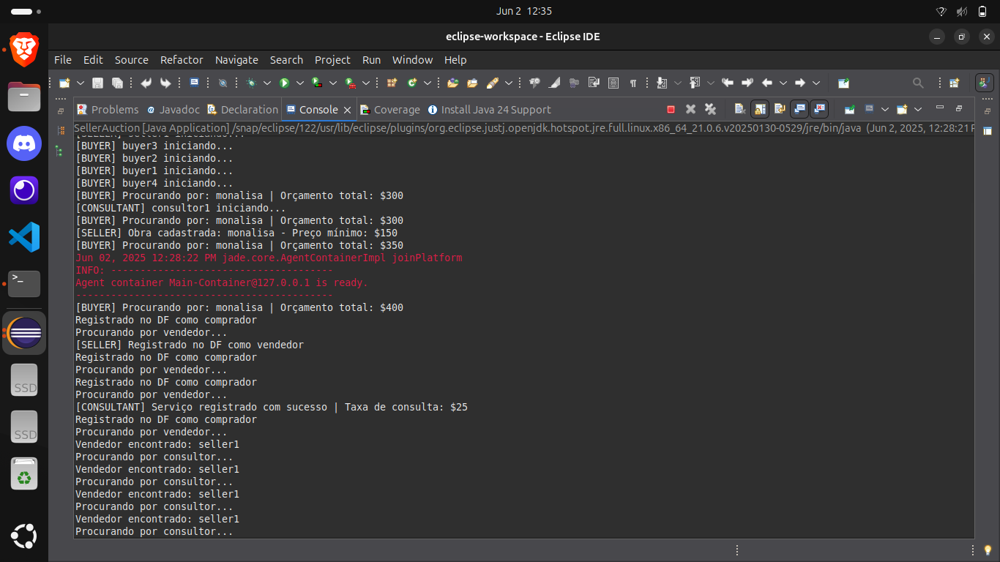
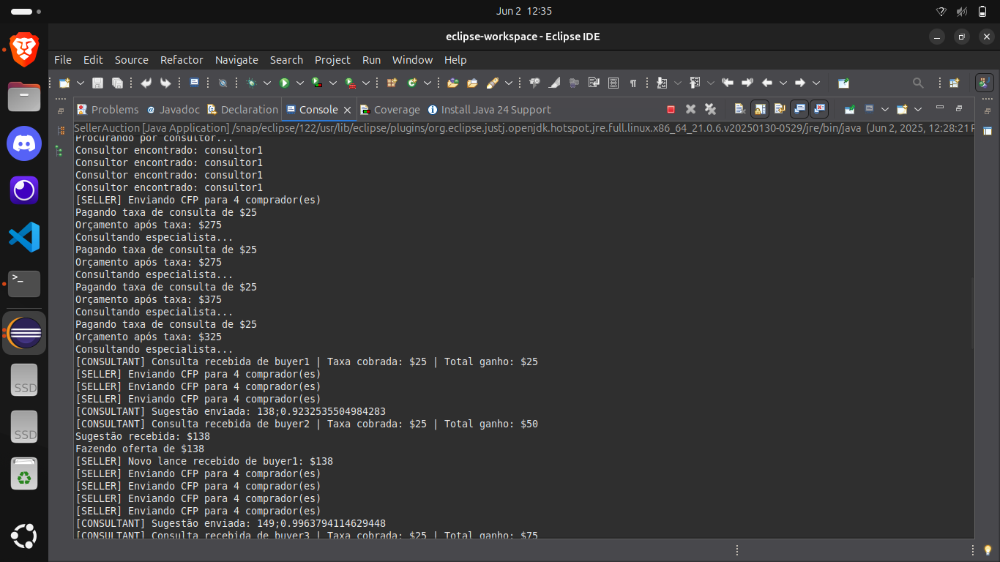
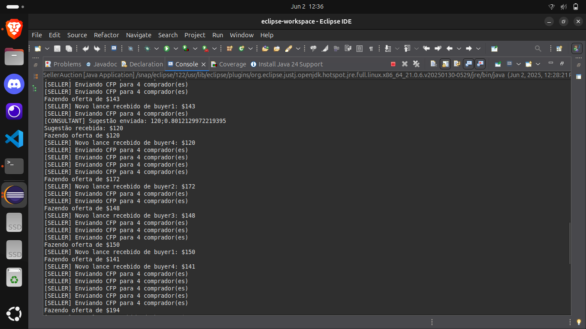
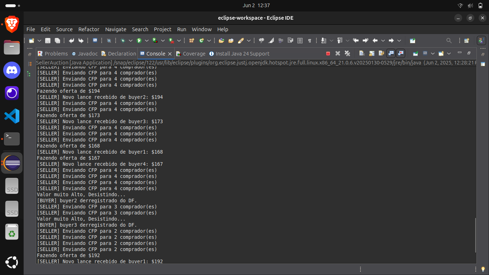
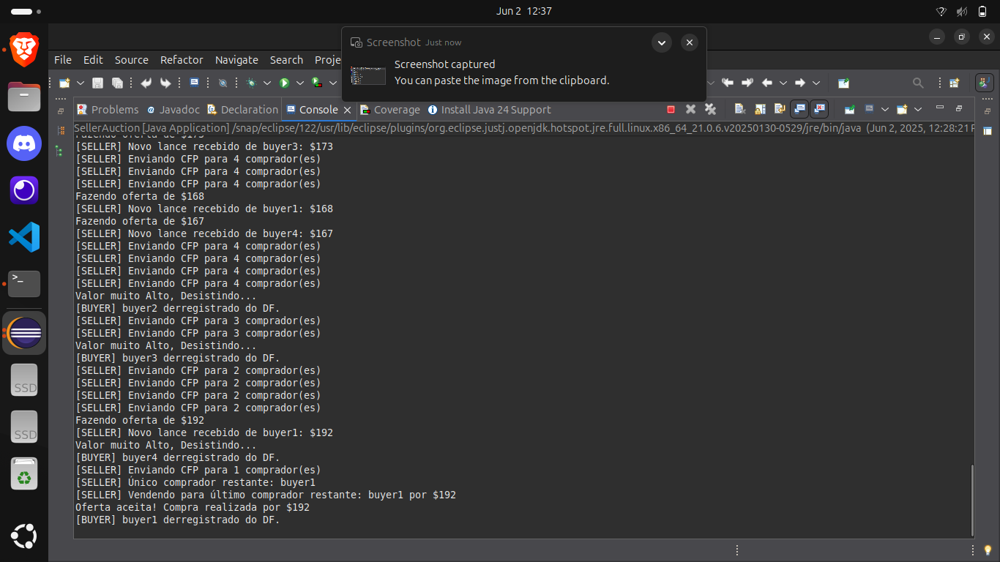

# 2025.1_G4_SMA_Leilão com Reputação

## Sistema Multiagentes Leilão com Reputação

**Disciplina**: FGA0053 - Sistemas Multiagentes  
**Nro do Grupo**: 4  
**Frente de Pesquisa**: Leilão com Reputação  

## Alunos
| Matrícula      | Aluno                           |
|----------------|---------------------------------|
| 232000712      | Alexandre Tostes S. e S. Junior |
| 241012202      | Davi Ursulino de Oliveira       |
| 170146243      | João Lucas Costa Vale           |
| 211061968      | João Pedro Veras Gomes          |
| 222006122      | João Vitor Alves Viana          |

## Sobre 
Desenvolvemos um sistema de múltiplos agentes para leilões online que incorpora uma técnica de avaliação da precisão dos especialistas. Diferentemente de outros sistemas que apenas praticam o preço, o nosso possibilita aos agentes avaliar o histórico de comportamento dos participantes, cooperando no estabelecimento de relações . A avaliação da precisão é feita de modo adaptáve, levando em consideração, entre outros, porcentagem de erro, refletindo as escolhas de compra e venda destes agentes. Tal abordagem reduz o comportamento especulativo e fomenta a troca contínua, fazendo com que o sistema se assemelhe a um mercado real onde existe variação. Além de ser uma aplicação válida dos princípios dos sistemas de multiagentes, o projeto constitui a base para estudos sobre negociação automática e construção de leilões reais em contextos descentralizados.

**Aplicações práticas**:
- Plataformas de e-commerce (ex: eBay)
- Sistemas de manutenção preditiva
- Alocação de recursos em ambientes IoT
- Clínicas odontológicas acadêmicas (agendamento de vagas)

**Referências fundamentais**:
- COSTA, Rosane R. da et al. (2016). Avaliação de sistema multiagente para leilões eletrônicos com reputação
- RABENHORST, Rodrigo; BILLA, Cleo Zanella (2016). Sistema multiagente com leilões para clínica odontológica
- JENNINGS, Nicholas R. (2001). Automated Negotiation: Prospects, Methods and Challenges

## Screenshots
<center>
<a id="img1">Imagem 1</a>  
  
<font size="2">
  <p style="text-align: center">
    <b>Fonte: ArtsAuction</b>
  </p>
</font>
</center>

<br>

<center>
<a id="img2">Imagem 2</a>  
  
<font size="2">
  <p style="text-align: center">
    <b>Fonte: ArtsAuction</b>
  </p>
</font>
</center>

<br>

<center>
<a id="img3">Imagem 3</a>  
  
<font size="2">
  <p style="text-align: center">
    <b>Fonte: ArtsAuction</b>
  </p>
</font>
</center>

<br>

<center>
<a id="img4">Imagem 4</a>  
  
<font size="2">
  <p style="text-align: center">
    <b>Fonte: ArtsAuction</b>
  </p>
</font>
</center>

<br>

<center>
<a id="img5">Imagem 5</a>  
  
<font size="2">
  <p style="text-align: center">
    <b>Fonte: ArtsAuction</b>
  </p>
</font>
</center>

<br>

<center>
<a id="img6">Imagem 6</a>  
  
<font size="2">
  <p style="text-align: center">
    <b>Fonte: ArtsAuction</b>
  </p>
</font>
</center>

<br>

<center>
<a id="img7">Imagem 7</a>  
  
<font size="2">
  <p style="text-align: center">
    <b>Fonte: ArtsAuction</b>
  </p>
</font>
</center>


## Instalação 
**Linguagens**: Java  
**Tecnologias**: JADE, Eclipse IDE  

**Pré-requisitos**:
1. JDK 17+
2. Eclipse IDE (última versão)
3. Biblioteca JADE

**Passos de instalação**:
```bash
git clone https://github.com/UnBSMA2025-1/2025.1_G4_SMA_LeilaoComReputacao.git
cd 2025.1_G4_SMA_LeilaoComReputacao
```

**Importar no Eclipse**:  
`File > Import > Existing Maven Projects`  

**Configuração JADE**:
- Adicionar JADE ao classpath (`jade.jar`)


## Uso
1. Iniciar plataforma JADE (container principal)  
2. Instanciar agentes:  
**Agente Consultor**: Possui conhecimento prévio sobre algumas obras e atua como avaliador do sistema. Ele é responsável por fornecer um valor mais próximo do produto com base em critérios próprios. Sua função é tentar fornecer a informação mais precisa.

**Agente Vendedor**: Registra uma ou mais obras no sistema e as coloca à venda através de leilões. Ele interage com o Comprador para disponibilizar as obras para receber lances. Também é responsável por aceitar a melhor proposta considerando valor do comprador.

**Agentes Compradores**: Possuem saldo limitado e estratégias próprias para participar dos leilões. Eles avaliam as obras disponíveis, analisam a reputação do Consultor, e fazem suas ofertas buscando maximizar o benefício da compra. Podem optar por não participar caso julguem que não vale a pena.


### Fluxo básico:
-Vendedor registra o item para leilão
-Comprador procura pelo item para e perguntar ao consultor qual o valor do item
-Consultor cobra uma taxa pela consulta e fornece um valor 
-Vendedor (leiloeiro) anuncia o leilão aos compradores
-Compradores enviam lances considerando tanto o valor do consultor ou caso não tenha, o próprio valor
-Vendedor declara o vencedor com base na combinação do valor do lance
-Sistema atualiza a reputação do consultor conforme o resultado do leilão

## Vídeo
[*Video de apresentação*](https://youtu.be/-1GAaNqihck)

## Participações
| Nome do Membro            | Contribuição | Significância | Comprovação |
|---------------------------|--------------|----------------|-------------|
| Alexandre Tostes          |  Desenvolvimento geral             |   Alta             |   https://github.com/UnBSMA2025-1/2025.1_G4_SMA_LeilaoComReputacao/tree/381dbe1e4c570e4a5c8f6cf4752c67e6b88dba7d          |
| Davi Ursulino             |       Desenvolvimento geral       |      Alta          |    "Algumas melhorias" [272b3fca348c49f5eb1644ce17c775ebdfdb08db](https://github.com/UnBSMA2025-1/2025.1_G4_SMA_LeilaoComReputacao/commit/272b3fca348c49f5eb1644ce17c775ebdfdb08db)         |
| João Lucas Costa Vale     |  Desenvolvimento geral        |         Alta       |      Commit organizacional: [0e865059c81a637c78bf73e779c480e3f30fd442](https://github.com/UnBSMA2025-1/2025.1_G4_SMA_LeilaoComReputacao/commit/7a4f2dfdcf9f7d848be63d03a6ac60801ec960fa)       |
| João Pedro Veras Gomes    |  |     |       |
| João Vitor Alves Viana    |  Desenvolvimento geral |     Alta  | 1- https://github.com/UnBSMA2025-1/2025.1_G4_SMA_LeilaoComReputacao/commit/4e10191497b090cd040d5376816433aafa0f05dc 2- https://github.com/UnBSMA2025-1/2025.1_G4_SMA_LeilaoComReputacao/commit/2409b042a84a0c1e0dc3d1c9037d9242036ff418 3- https://github.com/UnBSMA2025-1/2025.1_G4_SMA_LeilaoComReputacao/commit/75c6e340bb5970ad63ae6e4be5990cc1f37ed4c6|

*(Preencher durante desenvolvimento com commits específicos)*

## Outros

### Lições Aprendidas:
- Complexidade na modelagem de reputação dinâmica  
- Desafios na sincronização de múltiplos agentes  
- Importância de estratégias de equilíbrio entre valor e reputação  
- Dificuldades na simulação de comportamentos estratégicos

### Percepções:
Em uma primeira análise, percebemos que a implementação do leilão com reputação não seria fácil, pois, devido ao desconhecimento das tecnologias envolvidas e ao novo paradigma aprendido — como JADE, Java e Eclipse —, o processo se tornou mais demorado. Diante disso, decidimos focar no funcionamento principal do sistema, que é o leilão, e deixar a funcionalidade de reputação para ser implementada futuramente.

### Contribuições e Fragilidades: 
- Integrar sistema de reputação no consultor
- Organização do grupo 
- Pouco tempo de desenvolvimento
- Entendimento da linguem Java
- Instalação do Jade

### Trabalhos Futuros:
- Implementar diferentes algoritmos de reputação  
- Adicionar mecanismos para melhorar a interação entre agentes  
- Desenvolver interface gráfica para monitooramento  
- Incorporar aprendizado de máquina para adaptação de estratégias  
- Expandir para leilões combinatórios  

## Fontes

### Referências Selecionadas
- COSTA, Rosane R. da et al. *Avaliação de um sistema multiagente para leilões eletrônicos baseado em ontologias e reputação*. Revista Brasileira de Computação Aplicada, 2016.
- RABENHORST, Rodrigo; BILLA, Cleo Zanella. *Um sistema multiagente com leilões para a seleção de pacientes numa clínica odontológica*. Workshop-Escola de Sistemas de Agentes, 2016.
- MARTIN, A. et al. *Multi Agent Communication System for Online Auction with Decision Support System by JADE and TRACE*. Journal of Convergence Information Technology, 2009.
- LEE, Seung-Yong et al. *The study of autonomous negotiation system based on auction enabled intelligent agent*. International Journal of Software Engineering, 2014.

### Referências Adicionais
- BANASZEWSKI, Roni F. et al. *An application of a multi-agent auction-based protocol to the tactical planning of oil product transport*. Computers & Chemical Engineering, 2013.
- TANG, Shuang et al. *Intelligent agents for auction-based federated learning: a survey*. arXiv, 2024.
- JENNINGS, Nicholas R. *Automated Negotiation: Prospects, Methods and Challenges*. International Journal of Group Decision and Negotiation, 2001.
- RAMCHURN, Sarvapali D. et al. *Trust in multi-agent systems*. The Knowledge Engineering Review, 2004.
